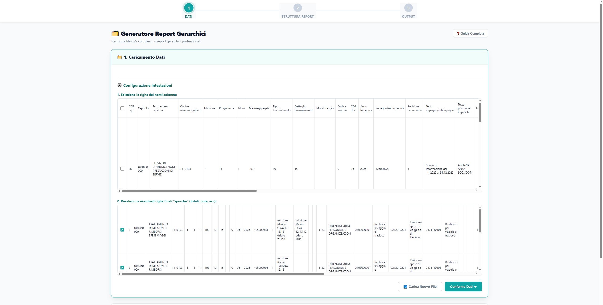
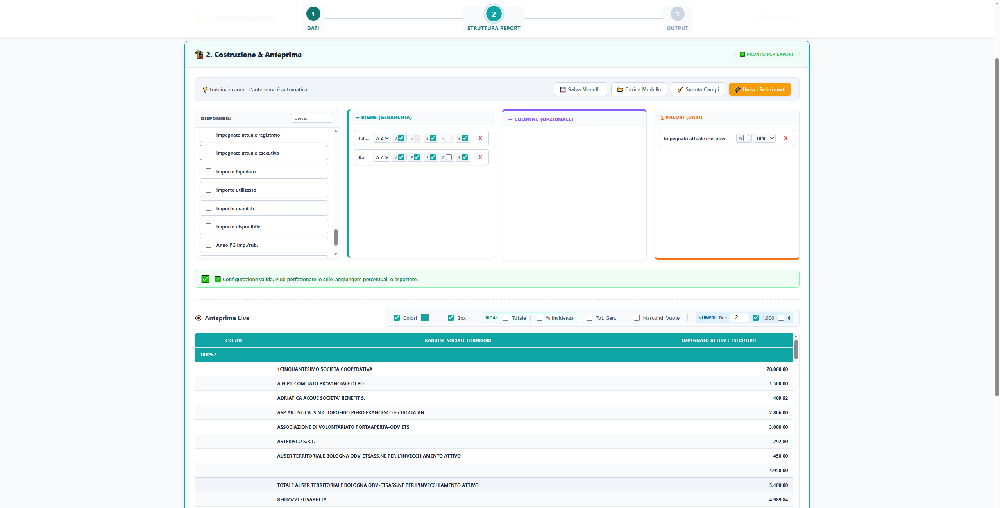

# 📊 Generatore Report Gerarchici (Web-Based)

Un'applicazione web **client-side** (single-page application) progettata per trasformare file CSV grezzi in report gerarchici professionali, in stile Pivot, pronti per essere stampati o condivisi.

L'applicazione funziona interamente nel browser senza inviare dati a server esterni, garantendo la massima privacy e velocità.

---

## ✨ Caratteristiche Principali

### 🔄 Importazione e Pulizia Dati
- **Supporto CSV Universale:** Carica qualsiasi file CSV (separatore virgola o punto e virgola).
- **Configurazione Intelligente:** Seleziona visivamente la riga di intestazione ed escludi righe di coda (totali, note) inutili.
- **Merge Campi:** Unisci due o più colonne (es. "Agente" + "Zona") direttamente nell'app e salva la "ricetta" per utilizzi futuri.

### 🏗️ Costruttore Drag & Drop
- **Interfaccia Intuitiva:** Trascina i campi nelle aree **Righe** (Gerarchia), **Colonne** (Pivot) e **Valori**.
- **Logica Gerarchica:** Crea livelli di raggruppamento nidificati (es. Regione > Provincia > Agente).
- **Personalizzazione Totale:**
  - Toggle **Espandi/Comprimi** per ogni livello.
  - **Subtotali** intermedi automatici.
  - **Modalità Compatta** per risparmiare spazio orizzontale.
  - Formattazione condizionale (Grassetto, Nascondi duplicati).

### 🎨 Anteprima e Stile
- **Anteprima Live:** Vedi il risultato in tempo reale mentre costruisci il report.
- **Temi Personalizzabili:** Scegli un colore principale e l'app calcolerà automaticamente le sfumature pastello per un look professionale.
- **Analisi Dati:**
  - Totali di Riga, Totali Generali.
  - Calcolo automatico **% Incidenza** sul totale.
  - Nascondi colonne vuote automaticamente.

### 💾 Export & Persistenza (Il vero punto di forza)
- **Excel (.xlsx) con FORMULE:** A differenza di altri tool che esportano solo valori statici, questo tool genera un Excel contenente le formule `=SUBTOTAL()` e i calcoli percentuali. L'utente finale può modificare i dati e i totali si aggiorneranno!
- **PDF Report:** Genera PDF pronti per la stampa, impaginati correttamente in orizzontale (Landscape).
- **Salvataggio Modelli (.json):** Salva la configurazione del report (struttura, stili, campi uniti) e ricaricala in futuro su nuovi dati CSV.

---

## 🚀 Come Usarlo

Non è necessaria alcuna installazione. L'applicazione è contenuta in un singolo file HTML.

1. **Scarica** o clona la repository.
2. Apri il file `Report Gemini19(pdf sistemato).html` (o rinominalo in `index.html`) con un browser moderno (Chrome, Edge, Firefox).
3. **Step 1:** Trascina il tuo CSV.
4. **Step 2:** Configura il report trascinando i campi.
5. **Step 3:** Esporta in Excel o PDF.

---

## 🛠️ Tecnologie Utilizzate

Il progetto è costruito in **Vanilla JavaScript**, HTML5 e CSS3 moderni. Si appoggia a librerie esterne caricate via CDN per funzionalità specifiche:

- **[PapaParse](https://www.papaparse.com/):** Parsing veloce e affidabile dei file CSV.
- **[SortableJS](https://sortablejs.github.io/Sortable/):** Gestione del Drag & Drop fluido.
- **[ExcelJS](https://github.com/exceljs/exceljs):** Generazione avanzata di file .xlsx (celle unite, stili, formule).
- **[jsPDF](https://github.com/parallax/jsPDF) & AutoTable:** Generazione di file PDF direttamente dal browser.

---

## 📸 Screenshots
Ecco come appare l'interfaccia di configurazione:

Ed ecco un esempio di report colorato pronto per l'export:

---

## 🤝 Contribuire

Sentiti libero di aprire **Issues** o inviare **Pull Requests**. Essendo un file unico, il codice è strutturato in sezioni (CSS, HTML, JS Logic) per facilitarne la lettura.

## 📄 Licenza

Distribuito sotto licenza MIT. Vedi `LICENSE` per maggiori informazioni.