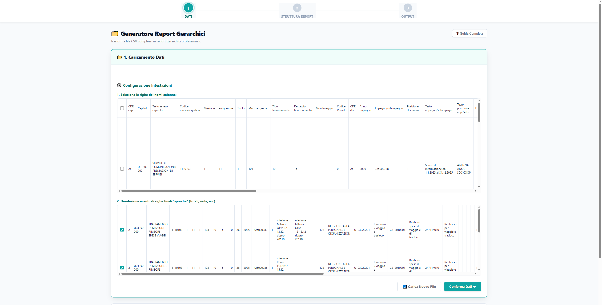
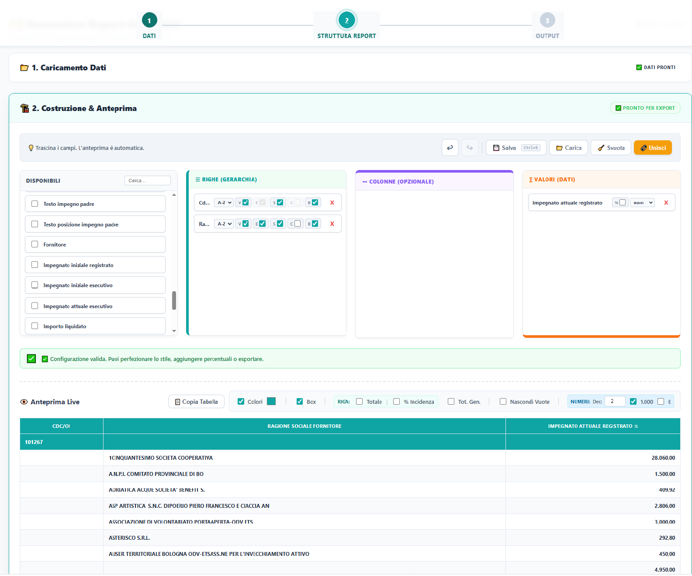

# 📊 Generatore Report Gerarchici (Web-Based)

-brightgreen.svg)

Un'applicazione web **client-side** (single-page application) progettata per trasformare file CSV grezzi in report gerarchici professionali, in stile Pivot, pronti per essere stampati o condivisi.

L'applicazione funziona interamente nel browser **senza inviare dati a server esterni**, garantendo la massima privacy e velocità.

---

## ✨ Caratteristiche Principali

### 🔄 Importazione e Pulizia Dati
- **Supporto CSV Universale:** Carica qualsiasi file CSV (separatore virgola o punto e virgola) tramite drag & drop o selezione da file system.
- **Configurazione Intelligente:** Seleziona visivamente la riga (o le righe) di intestazione ed escludi righe di coda inutili (totali precalcolati, note, righe vuote).
- **Merge Campi:** Unisci due o più colonne (es. "Nome" + "Cognome") direttamente nell'app. La "ricetta" di unione viene salvata insieme al modello per utilizzi futuri.

### 🧹 Normalizzazione Testo *(Nuovo)*
- **Pannello di pulizia per colonna:** Prima di costruire il report, normalizza i valori testuali del CSV direttamente in memoria senza modificare il file originale.
- **Rilevamento automatico del tipo:** ogni colonna viene classificata come *Testo*, *Numerico* o *Misto* e le opzioni disponibili si adattano di conseguenza.
- **Anteprima in tempo reale:** vedi il valore originale → trasformato mentre spunti le opzioni, prima di applicare qualsiasi modifica.
- **Operazioni disponibili per colonna:**
  - ✂️ **Trim** — rimuove spazi e tabulazioni agli estremi della stringa
  - ⎵ **Spazi doppi** — riduce sequenze di spazi interni a uno solo
  - 🔠 **Maiuscolo / 🔡 Minuscolo / 🔤 Prima Lettera** — normalizzazione capitalizzazione (si escludono a vicenda)
  - ✔ **Sì/No** — standardizza varianti booleane (`si`, `yes`, `1`, `true`, `x` → `Sì`; `no`, `0`, `false` → `No`)
  - 🗑 **Rimuovi punteggiatura** — elimina `.` `,` `;` `:` `!` `?` `"` `'` `( )` `[ ]` `{ }` `- _ / \`
- **Applica a tutte:** barra rapida per applicare un'operazione a tutte le colonne in un click.

### 🏗️ Costruttore Drag & Drop
- **Interfaccia Intuitiva:** Trascina i campi nelle aree **Righe** (Gerarchia), **Colonne** (Pivot) e **Valori**.
- **Feedback visivo durante il drag:** placeholder animato che mostra dove atterrerà l'elemento.
- **Logica Gerarchica:** Crea livelli di raggruppamento nidificati (es. Regione > Provincia > Agente).
- **Personalizzazione Totale per ogni campo:**
  - Ordinamento **A-Z / Z-A** per ogni livello gerarchico
  - Toggle **Espandi/Comprimi** per ogni livello
  - **Subtotali** intermedi automatici
  - **Modalità Compatta** per risparmiare spazio orizzontale
  - Formattazione condizionale (Grassetto, Nascondi duplicati)
- **Funzione % sui Valori:** mostra un campo numerico come percentuale sul totale colonna anziché valore assoluto.
- **Barra di ricerca** nella lista Disponibili per trovare rapidamente campi su CSV con molte colonne.

### ↩ Undo / Redo *(Nuovo)*
- Annulla e ripristina qualsiasi modifica alla struttura del report (drag & drop, rimozioni, riordinamenti).
- Storico fino a **40 stati** con pulsanti dedicati e shortcut da tastiera (`Ctrl+Z` / `Ctrl+Y`).

### 🎨 Anteprima e Stile
- **Anteprima Live:** Vedi il risultato in tempo reale mentre costruisci il report.
- **Temi Personalizzabili:** Scegli un colore principale e l'app calcola automaticamente le sfumature pastello per un look professionale.
- **Ordinamento colonne:** Clicca sull'intestazione di qualsiasi colonna numerica nell'anteprima per ordinare i dati (crescente/decrescente). Le righe di totale rimangono sempre in fondo.
- **Analisi Dati:**
  - Totali di Riga e Totali Generali
  - Calcolo automatico **% Incidenza** sul totale
  - Nascondi colonne vuote automaticamente

### 📋 Copia negli Appunti *(Nuovo)*
- Bottone **"Copia Tabella"** nell'anteprima live.
- Copia in **due formati simultaneamente:**
  - **HTML formattato** → incollando in Word o Outlook mantiene colori, bordi e grassetti
  - **TSV (tab-separated)** → incollando in Excel o Google Sheets distribuisce i dati nelle celle
- Fallback automatico per browser che non supportano la Clipboard API moderna.

### 🔔 Notifiche Toast *(Nuovo)*
- Tutti i messaggi di sistema (errori, conferme, avvisi) usano notifiche non bloccanti in basso a destra al posto dei classici `alert()` nativi del browser.

### ⏳ Indicatore di Caricamento *(Nuovo)*
- Overlay con spinner animato durante la generazione di file Excel e PDF, con messaggio descrittivo del processo in corso.

### 💾 Export & Persistenza
- **Excel (.xlsx) con FORMULE:** Genera un Excel contenente le formule `=SUBTOTAL()` e i calcoli percentuali. L'utente finale può modificare i dati e i totali si aggiorneranno automaticamente.
- **PDF Report:** Genera PDF pronti per la stampa, impaginati correttamente in orizzontale (Landscape).
- **Salvataggio Modelli (.json):** Salva la configurazione del report (struttura, stili, campi uniti, normalizzazioni) e ricaricala in futuro su nuovi dati CSV.

---

## ⌨️ Shortcut da Tastiera

| Shortcut | Azione |
|---|---|
| `Ctrl+Z` | Annulla ultima modifica |
| `Ctrl+Y` | Ripeti ultima modifica annullata |
| `Ctrl+S` | Salva modello configurazione |
| `Ctrl+Invio` | Avanza allo step successivo |

---

## 🚀 Come Usarlo

Non è necessaria alcuna installazione. L'applicazione è contenuta in un **singolo file HTML**.

1. **Scarica** il file `index.html` (o clona la repository).
2. Aprilo con un browser moderno (Chrome, Edge, Firefox).
3. **Step 1 — Dati:** Trascina il tuo CSV. Opzionalmente, normalizza il testo prima di procedere.
4. **Step 2 — Struttura:** Configura il report trascinando i campi nelle aree Righe, Colonne e Valori.
5. **Step 3 — Export:** Esporta in Excel o PDF, oppure copia la tabella negli appunti.

---

## 🛠️ Tecnologie Utilizzate

Il progetto è costruito in **Vanilla JavaScript**, HTML5 e CSS3, senza framework. Si appoggia a librerie esterne caricate via CDN:

| Libreria | Utilizzo |
|---|---|
| [PapaParse](https://www.papaparse.com/) | Parsing veloce e affidabile dei file CSV |
| [SortableJS](https://sortablejs.github.io/Sortable/) | Drag & Drop fluido con ghost placeholder |
| [ExcelJS](https://github.com/exceljs/exceljs) | Generazione .xlsx con celle unite, stili e formule |
| [jsPDF](https://github.com/parallax/jsPDF) + AutoTable | Generazione PDF direttamente nel browser |
| [FileSaver.js](https://github.com/eligrey/FileSaver.js/) | Download affidabile dei file generati |

---

## 📸 Screenshots

Caricamento e configurazione dati:

Anteprima live del report colorato:

---

## 📋 Changelog

### v2.0
- ✅ Aggiunta funzionalità **Normalizzazione Testo** con anteprima live e 7 operazioni di pulizia
- ✅ Aggiunto bottone **Copia Tabella negli Appunti** (HTML + TSV)
- ✅ Sistema **Undo/Redo** con storico 40 stati e shortcut da tastiera
- ✅ Sostituzione di tutti gli `alert()` nativi con **notifiche Toast** non bloccanti
- ✅ **Spinner di caricamento** durante la generazione Excel/PDF
- ✅ **Ordinamento colonne** cliccando sull'intestazione nell'anteprima
- ✅ **Shortcut da tastiera** (`Ctrl+S`, `Ctrl+Z`, `Ctrl+Y`, `Ctrl+Invio`)
- ✅ Aree drag & drop con **sfondo colorato** distintivo per Righe/Colonne/Valori
- ✅ **Ghost placeholder** animato durante il drag
- ✅ Messaggi di errore CSV più specifici e descrittivi
- ✅ Guida completa aggiornata con tutte le nuove funzionalità

### v1.2
- ✅ Merge campi personalizzati con salvataggio nel modello .json
- ✅ Doppia intestazione pivot-style per export Excel
- ✅ Fix logica subtotali e percentuali

### v1.0
- 🎉 Release iniziale

---

## 🤝 Contribuire

Sentiti libero di aprire **Issues** o inviare **Pull Requests**. Essendo un file unico, il codice è strutturato in sezioni commentate (CSS, HTML, JS Logic) per facilitarne la lettura e la manutenzione.

## 📄 Licenza

Distribuito sotto licenza **MIT**. Vedi `LICENSE` per maggiori informazioni.
